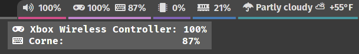

# Go Bluetooth Battery Life (gobbl)

A simple Go utility to get and display connected bluetooth device battery levels via the Bluez's D-Bus interface. Intended for use with statusbars and tiling WMs, or other Desktop Environment extensions

